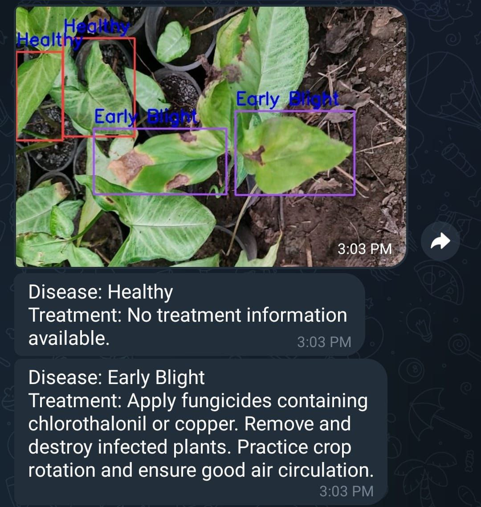

# 🍅 Tomato Disease Detection using YOLOv8

A real-time computer vision system for **tomato leaf disease detection and monitoring** built using **YOLOv8, OpenCV, and Supervision**.

This project demonstrates an end-to-end machine learning workflow from **dataset acquisition and model training** to **live deployment and alerting systems**.

It includes:

- model training pipeline in Google Colab
- real-time local webcam / IP camera inference
- annotated live predictions
- Telegram alerting with treatment recommendations
- modular deployment scripts

---

## 🚀 Project Overview

This system detects tomato leaf conditions in real time and classifies them into multiple disease categories such as:

- Healthy
- Early Blight
- Late Blight
- Leaf Mold
- Septoria
- Leaf Miner
- Yellow Leaf Curl Virus

The system can be used in:

- smart agriculture
- greenhouse monitoring
- precision farming systems
- AI-powered crop health surveillance

---

## 📂 Project Structure

```text
tomato-disease-detection-yolov8/
│
├── notebooks/
│   └── training_pipeline.ipynb
│
├── models/
│   └── tomato_disease_yolov8_best.pt
│
├── src/
│   ├── app_local.py
│   ├── app_telegram_alert.py
│
├── assets/
│   └── telegram_sample_result.png
│
└── README.md
```

---

## 🧠 Model Training

The model was trained using **YOLOv8** on a tomato leaf disease dataset downloaded from Roboflow.

Training workflow includes:

- dataset download
- preprocessing
- transfer learning
- validation
- model export

Notebook available in:

```text
notebooks/training_pipeline.ipynb
```

---

## 📊 Model Performance

Validation results achieved by the final deployed model:

| Metric | Score |
|---|---:|
| Precision | 0.915 |
| Recall | 0.880 |
| mAP@50 | 0.944 |
| mAP@50:95 | 0.849 |

These results demonstrate strong performance for real-world agricultural monitoring applications.

---

## 💻 Local Real-Time Inference

Run local webcam detection:

```bash
python src/app_local.py
```

This launches real-time prediction with:

- live bounding boxes
- disease labels
- instant inference

---

## 📩 Telegram Alerting System

Run remote monitoring version:

```bash
python src/app_telegram_alert.py
```

Features:

- periodic image capture
- annotated prediction snapshots
- automatic Telegram alerts
- treatment recommendation messages

This simulates an **IoT-enabled smart agriculture monitoring system**.

---

## 🖼️ Sample Output

Below is a sample Telegram alert showing:

- detected healthy leaves
- infected leaves
- treatment recommendations



---

## 🛠️ Tech Stack

- Python
- YOLOv8
- Ultralytics
- OpenCV
- Supervision
- Roboflow
- Matplotlib
- Telegram Bot API

---

## 🌱 Real-World Applications

This project showcases concepts applicable to:

- precision agriculture
- crop disease monitoring
- smart greenhouse systems
- AI-based farming assistance
- edge computer vision deployment

---
